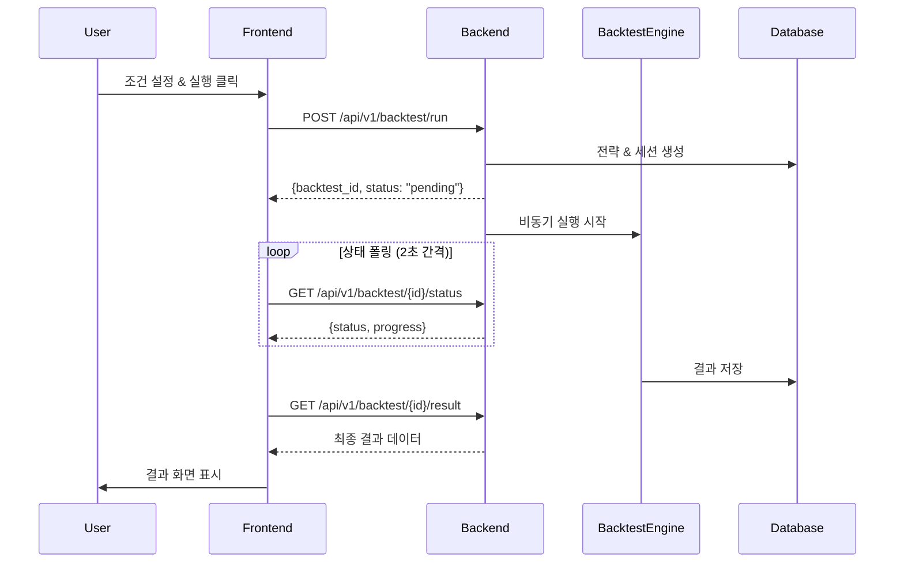

# SL Quant Investment Platform - Integration Guide

## 📋 개요

이 문서는 **SL-Back-Test** (백엔드)와 **SL-Front-End** (프론트엔드) 프레임워크 간의 연동 구조를 설명합니다.

## 🏗️ 시스템 아키텍처

```
┌─────────────────────────────────────────────────────────────────┐
│                        Frontend (Next.js)                        │
│                       http://localhost:3000                      │
│                                                                  │
│  ┌──────────────┐  ┌──────────────┐  ┌──────────────┐          │
│  │   Pages      │  │  Components  │  │    Hooks     │          │
│  │              │  │              │  │              │          │
│  │  /quant/new  │  │  ConditionUI │  │ useBacktest  │          │
│  │  /quant/     │  │  ChartView   │  │  useFactors  │          │
│  │   result     │  │  TradeList   │  │ useFunctions │          │
│  └──────────────┘  └──────────────┘  └──────────────┘          │
│                             │                                    │
│                             ▼                                    │
│                    ┌──────────────┐                             │
│                    │  API Client  │                             │
│                    │   (Axios)    │                             │
│                    └──────────────┘                             │
└─────────────────────────────│───────────────────────────────────┘
                              │ HTTP/REST
                              ▼
┌─────────────────────────────────────────────────────────────────┐
│                       Backend (FastAPI)                          │
│                      http://localhost:8000                       │
│                                                                  │
│  ┌──────────────┐  ┌──────────────┐  ┌──────────────┐          │
│  │  API Routes  │  │   Services   │  │   Models     │          │
│  │              │  │              │  │              │          │
│  │  /backtest   │  │ BacktestEngine│ │ Simulation  │          │
│  │  /factors    │  │FactorCalc    │  │ StockPrice  │          │
│  │  /functions  │  │  DataLoader  │  │  Company    │          │
│  └──────────────┘  └──────────────┘  └──────────────┘          │
│                             │                                    │
│                             ▼                                    │
│         ┌──────────────────────────────────┐                   │
│         │    PostgreSQL 15 + Redis 7       │                   │
│         └──────────────────────────────────┘                   │
└─────────────────────────────────────────────────────────────────┘
```

## 🔧 수정 사항

### 1. Frontend 환경 설정 (완료)

**파일**: `/Users/a2/Desktop/branch-restore/SL-Front-End/.env.local`

```env
# API Configuration
NEXT_PUBLIC_API_BASE_URL=http://localhost:8000/api/v1

# App Configuration
NEXT_PUBLIC_APP_URL=http://localhost:3000
NEXT_PUBLIC_APP_NAME=SL Quant Investment Platform

# Development Settings
NODE_ENV=development
```

### 2. Axios 클라이언트 설정 (완료)

**파일**: `/Users/a2/Desktop/branch-restore/SL-Front-End/src/lib/axios.ts`

수정 내용:
- 기본 URL을 `http://localhost:3001`에서 `http://localhost:8000/api/v1`로 변경
- 서버 인스턴스도 동일하게 업데이트

### 3. Backend API Routes 추가 (완료)

**파일**: `/Users/a2/Desktop/branch-restore/SL-Back-Test/app/api/routes/backtest.py`

새로 생성된 엔드포인트:
- `POST /api/v1/backtest/run` - 백테스트 실행
- `GET /api/v1/backtest/{backtest_id}/status` - 상태 확인
- `GET /api/v1/backtest/{backtest_id}/result` - 결과 조회
- `GET /api/v1/backtest/list` - 백테스트 목록
- `GET /api/v1/factors/list` - 팩터 목록
- `GET /api/v1/functions/list` - 함수 목록

### 4. Frontend API 클라이언트 수정 (완료)

다음 파일들의 API 엔드포인트 경로 수정:
- `/Users/a2/Desktop/branch-restore/SL-Front-End/src/lib/api/backtest.ts`
- `/Users/a2/Desktop/branch-restore/SL-Front-End/src/lib/api/factors.ts`
- `/Users/a2/Desktop/branch-restore/SL-Front-End/src/lib/api/functions.ts`

## 📡 API 엔드포인트 매핑

| 기능 | Frontend 호출 | Backend 엔드포인트 | 메소드 |
|------|--------------|-------------------|--------|
| 백테스트 실행 | `runBacktest()` | `/api/v1/backtest/run` | POST |
| 상태 확인 | `getBacktestStatus()` | `/api/v1/backtest/{id}/status` | GET |
| 결과 조회 | `getBacktestResult()` | `/api/v1/backtest/{id}/result` | GET |
| 목록 조회 | `getBacktestList()` | `/api/v1/backtest/list` | GET |
| 팩터 목록 | `getFactors()` | `/api/v1/factors/list` | GET |
| 함수 목록 | `getFunctions()` | `/api/v1/functions/list` | GET |

## 🔄 백테스트 실행 플로우



## 🚀 실행 방법

### 1. Backend 서버 시작

```bash
cd SL-Back-Test

# 환경 변수 설정 (.env 파일 확인)
cp .env.example .env

# 가상환경 활성화
python -m venv venv
source venv/bin/activate  # Windows: venv\Scripts\activate

# 의존성 설치
pip install -r requirements.txt

# 데이터베이스 마이그레이션 (필요시)
alembic upgrade head

# 서버 실행
uvicorn app.main:app --reload --host 0.0.0.0 --port 8000
```

### 2. Frontend 서버 시작

```bash
cd SL-Front-End

# 의존성 설치
npm install

# 개발 서버 실행
npm run dev
```

### 3. 서비스 접속

- Frontend: http://localhost:3000
- Backend API Docs: http://localhost:8000/docs
- Backend Health Check: http://localhost:8000/health

## ✅ 통합 테스트 체크리스트

- [x] Backend 서버 정상 구동
- [x] Frontend 서버 정상 구동
- [x] CORS 설정 확인 (localhost:3000 허용)
- [x] API baseURL 설정 확인
- [x] 백테스트 라우트 등록
- [x] API 엔드포인트 경로 일치
- [ ] 팩터 목록 API 호출 테스트
- [ ] 함수 목록 API 호출 테스트
- [ ] 백테스트 실행 플로우 테스트
- [ ] 상태 폴링 동작 확인
- [ ] 결과 조회 및 표시

## 🐛 문제 해결 가이드

### 1. CORS 에러 발생 시

Backend의 `SL-Back-Test/app/core/config.py` 파일에서:
```python
BACKEND_CORS_ORIGINS: List[str] = ["http://localhost:3000"]
```

### 2. API 연결 실패 시

1. Backend 서버가 8000 포트에서 실행 중인지 확인
2. Frontend `.env.local` 파일의 `NEXT_PUBLIC_API_BASE_URL` 확인
3. 네트워크 탭에서 실제 요청 URL 확인

### 3. 데이터베이스 연결 실패

1. PostgreSQL이 실행 중인지 확인
2. `.env` 파일의 `DATABASE_URL` 설정 확인
3. 데이터베이스 마이그레이션 실행 여부 확인

### 4. Redis 연결 실패 (캐시)

1. Redis 서버 실행 상태 확인
2. `.env` 파일의 `REDIS_URL` 설정 확인
3. 캐시 비활성화: `ENABLE_CACHE=False`

## 📊 성능 최적화 포인트

1. **Backend 최적화**
   - Polars 사용으로 대용량 데이터 처리
   - Redis 캐싱으로 반복 쿼리 최적화
   - 비동기 처리로 동시성 향상
   - 청크 단위 데이터 처리

2. **Frontend 최적화**
   - React Query로 캐싱 및 상태 관리
   - 무한 스크롤로 대용량 데이터 처리
   - SSR로 초기 로딩 최적화
   - Zustand로 경량 상태 관리

## 📝 추가 개발 필요 사항

1. **인증/인가**
   - JWT 토큰 기반 인증
   - 사용자별 백테스트 관리

2. **실시간 통신**
   - WebSocket으로 실시간 진행률 업데이트
   - Server-Sent Events (SSE) 고려

3. **모니터링**
   - 로깅 시스템 구축
   - 에러 트래킹 (Sentry 등)
   - 성능 모니터링

4. **배포**
   - Docker 컨테이너화
   - CI/CD 파이프라인
   - 환경별 설정 관리

## 📚 관련 문서

- [Backend README](/Users/a2/Desktop/branch-restore/SL-Back-Test/README.md)
- [Frontend README](/Users/a2/Desktop/branch-restore/SL-Front-End/README.md)
- [API Documentation](http://localhost:8000/docs)
- [Database Schema](/Users/a2/Desktop/branch-restore/SL-Back-Test/docs/schema.md)

---

최종 업데이트: 2025-11-04
작성자: Claude AI Assistant