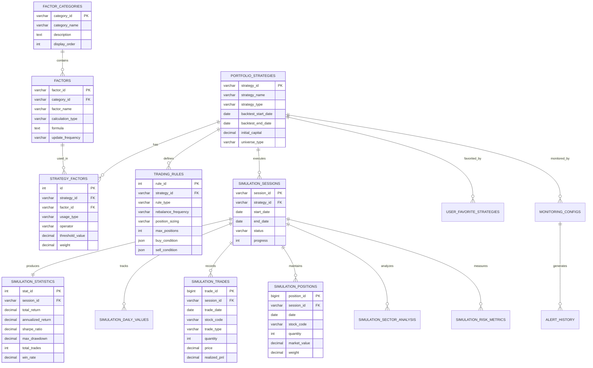

# 퀀트 투자 시뮬레이션 시스템 설계서
## GenPort 스타일 백테스팅 플랫폼

## 1. 시스템 개요

- **팩터 기반 투자**: 다양한 팩터를 조합한 투자 전략 구성
- **조건식 설정**: 스크리닝, 랭킹, 스코어링을 통한 종목 선별
- **백테스팅**: 과거 데이터 기반 전략 성과 검증
- **리스크 분석**: MDD, 샤프비율 등 다양한 리스크 지표 제공
- **포트폴리오 관리**: 리밸런싱, 종목 비중 관리

## 2. ERD (Entity Relationship Diagram)



## 3. 핵심 테이블 상세 설명

### 3.1 팩터 관리 테이블

#### factors 테이블
- **목적**: 투자 전략에 사용될 팩터 정의
- **주요 팩터 예시**:
  - **가치 팩터**: PER, PBR, PSR, EV/EBITDA
  - **성장 팩터**: 매출성장률, 이익성장률, ROE 변화율
  - **퀄리티 팩터**: ROE, ROA, 부채비율, 이익품질
  - **모멘텀 팩터**: 1개월/3개월/6개월 수익률
  - **저변동성**: 베타, 변동성, 하방변동성

### 3.2 전략 설정 테이블

#### portfolio_strategies 테이블
- **유니버스 설정**: KOSPI, KOSDAQ, KOSPI200 등
- **시가총액 필터**: 대형주, 중형주, 소형주
- **섹터 필터**: 특정 업종 포함/제외
- **유동성 필터**: 최소 거래량/거래대금 설정

#### trading_rules 테이블
- **리밸런싱**: 일별, 주별, 월별, 분기별, 연도별
- **포지션 사이징**: 동일가중, 시가총액가중, 리스크패리티
- **리스크 관리**: 손절매, 익절매, 트레일링 스탑

### 3.3 시뮬레이션 결과 테이블

#### simulation_statistics 테이블
주요 성과 지표를 저장:
- **CAGR** (연환산 수익률)
- **MDD** (최대 낙폭)
- **샤프 비율** (위험 조정 수익률)
- **승률** (수익 거래 비율)
- **손익비** (평균 수익/평균 손실)

## 4. 사용 예시

### 4.1 팩터 데이터 삽입

```sql
-- 팩터 카테고리 추가
INSERT INTO factor_categories (category_id, category_name, description) VALUES
('VALUE', '가치', '저평가 종목 발굴을 위한 가치 지표'),
('GROWTH', '성장', '기업의 성장성을 평가하는 지표'),
('QUALITY', '퀄리티', '기업의 수익성과 안정성 지표'),
('MOMENTUM', '모멘텀', '주가 추세와 모멘텀 지표'),
('VOLATILITY', '변동성', '리스크와 변동성 관련 지표');

-- 팩터 추가
INSERT INTO factors (factor_id, category_id, factor_name, calculation_type, formula, update_frequency) VALUES
('PER', 'VALUE', '주가수익비율', 'FUNDAMENTAL', 'price / earnings_per_share', 'QUARTERLY'),
('PBR', 'VALUE', '주가순자산비율', 'FUNDAMENTAL', 'price / book_value_per_share', 'QUARTERLY'),
('ROE', 'QUALITY', '자기자본이익률', 'FUNDAMENTAL', 'net_income / equity', 'QUARTERLY'),
('REVENUE_GROWTH', 'GROWTH', '매출성장률', 'FUNDAMENTAL', '(revenue_ttm / revenue_ttm_prev - 1) * 100', 'QUARTERLY'),
('MOM_1M', 'MOMENTUM', '1개월 수익률', 'TECHNICAL', '(price / price_1m_ago - 1) * 100', 'DAILY');
```

### 4.2 전략 생성 및 설정

```sql
-- 전략 생성
INSERT INTO portfolio_strategies (
    strategy_id, 
    strategy_name, 
    strategy_type,
    backtest_start_date, 
    backtest_end_date,
    initial_capital,
    universe_type,
    market_cap_filter
) VALUES (
    UUID(), 
    '저PER + 고ROE 전략',
    'VALUE',
    '2020-01-01', 
    '2023-12-31',
    100000000,
    'KOSPI200',
    'ALL'
);

-- 팩터 설정
INSERT INTO strategy_factors (strategy_id, factor_id, usage_type, operator, threshold_value, weight, direction) VALUES
(@strategy_id, 'PER', 'SCREENING', 'LT', 10, NULL, 'NEGATIVE'),  -- PER < 10
(@strategy_id, 'ROE', 'SCREENING', 'GT', 15, NULL, 'POSITIVE'),  -- ROE > 15%
(@strategy_id, 'PBR', 'RANKING', 'TOP_N', 30, 0.5, 'NEGATIVE'),  -- PBR 하위 30%
(@strategy_id, 'MOM_1M', 'RANKING', 'TOP_N', 30, 0.5, 'POSITIVE'); -- 모멘텀 상위 30%

-- 매매 규칙 설정
INSERT INTO trading_rules (
    strategy_id,
    rule_type,
    rebalance_frequency,
    rebalance_day,
    position_sizing,
    max_positions,
    stop_loss_pct,
    commission_rate,
    tax_rate
) VALUES (
    @strategy_id,
    'REBALANCE',
    'MONTHLY',
    1,  -- 매월 1일
    'EQUAL_WEIGHT',
    20,  -- 최대 20종목
    -10,  -- -10% 손절
    0.00015,  -- 0.015% 수수료
    0.0023  -- 0.23% 세금
);
```

### 4.3 시뮬레이션 실행 및 결과 조회

```sql
-- 시뮬레이션 실행
INSERT INTO simulation_sessions (
    session_id,
    strategy_id,
    session_name,
    start_date,
    end_date,
    initial_capital,
    benchmark,
    status
) VALUES (
    UUID(),
    @strategy_id,
    '2020-2023 백테스트',
    '2020-01-01',
    '2023-12-31',
    100000000,
    'KOSPI',
    'RUNNING'
);

-- 시뮬레이션 결과 조회
SELECT 
    ss.session_name,
    st.annualized_return as 'CAGR (%)',
    st.total_return as '총 수익률 (%)',
    st.sharpe_ratio as '샤프비율',
    st.max_drawdown as 'MDD (%)',
    st.win_rate as '승률 (%)',
    st.total_trades as '총 거래수',
    st.avg_holding_period as '평균 보유기간(일)'
FROM simulation_sessions ss
JOIN simulation_statistics st ON ss.session_id = st.session_id
WHERE ss.strategy_id = @strategy_id
ORDER BY ss.created_at DESC;

-- 월별 수익률 조회
SELECT 
    YEAR(date) as year,
    MONTH(date) as month,
    SUM(daily_return) as monthly_return
FROM simulation_daily_values
WHERE session_id = @session_id
GROUP BY YEAR(date), MONTH(date)
ORDER BY year, month;
```

### 4.4 성과 비교

```sql
-- 여러 전략 성과 비교
SELECT 
    ps.strategy_name,
    AVG(st.annualized_return) as avg_cagr,
    AVG(st.sharpe_ratio) as avg_sharpe,
    AVG(st.max_drawdown) as avg_mdd,
    COUNT(ss.session_id) as backtest_count,
    MAX(st.annualized_return) as best_cagr,
    MIN(st.max_drawdown) as best_mdd
FROM portfolio_strategies ps
JOIN simulation_sessions ss ON ps.strategy_id = ss.strategy_id
JOIN simulation_statistics st ON ss.session_id = st.session_id
WHERE ss.status = 'COMPLETED'
GROUP BY ps.strategy_id
ORDER BY avg_sharpe DESC;
```

## 5. 고급 기능

### 5.1 팩터 조합 최적화

```python
# 팩터 가중치 최적화 예시
def optimize_factor_weights(factors, historical_data):
    """
    과거 데이터를 기반으로 최적 팩터 가중치 계산
    """
    from scipy.optimize import minimize
    
    def objective(weights):
        portfolio_return = calculate_portfolio_return(factors, weights, historical_data)
        portfolio_risk = calculate_portfolio_risk(factors, weights, historical_data)
        sharpe_ratio = (portfolio_return - risk_free_rate) / portfolio_risk
        return -sharpe_ratio  # 최대화를 위해 음수 반환
    
    constraints = [
        {'type': 'eq', 'fun': lambda x: sum(x) - 1},  # 가중치 합 = 1
        {'type': 'ineq', 'fun': lambda x: x}  # 모든 가중치 >= 0
    ]
    
    result = minimize(objective, initial_weights, constraints=constraints)
    return result.x
```

### 5.2 리스크 패리티 포트폴리오

```sql
-- 리스크 기여도 균등화 포트폴리오 구성
WITH risk_contributions AS (
    SELECT 
        stock_code,
        weight,
        volatility,
        correlation_with_portfolio,
        weight * volatility * correlation_with_portfolio as risk_contribution
    FROM simulation_positions
    WHERE session_id = @session_id AND date = @date
)
SELECT 
    stock_code,
    weight,
    risk_contribution,
    risk_contribution / SUM(risk_contribution) OVER () as risk_contribution_pct,
    1.0 / COUNT(*) OVER () as target_risk_contribution_pct
FROM risk_contributions;
```

### 5.3 동적 자산 배분

```sql
-- 시장 상황에 따른 동적 자산 배분
CREATE TABLE dynamic_allocation_rules (
    rule_id INT AUTO_INCREMENT PRIMARY KEY,
    strategy_id VARCHAR(36) NOT NULL,
    
    -- 시장 상황 지표
    market_condition VARCHAR(30),  -- BULL, BEAR, SIDEWAYS
    vix_threshold DECIMAL(5,2),
    
    -- 배분 조정
    equity_weight_adjustment DECIMAL(5,2),
    cash_weight_adjustment DECIMAL(5,2),
    max_leverage DECIMAL(3,2),
    
    FOREIGN KEY (strategy_id) REFERENCES portfolio_strategies(strategy_id)
);
```

## 6. 성능 최적화 팁

### 6.1 인덱스 전략
- 자주 조회되는 날짜, 종목코드에 복합 인덱스 생성
- 대용량 테이블은 파티셔닝 적용 (연도별/월별)

### 6.2 집계 테이블
- 일별 데이터를 월별/연도별로 미리 집계
- 자주 계산되는 지표는 트리거로 자동 계산

### 6.3 캐싱 전략
- Redis를 활용한 실시간 계산 결과 캐싱
- 자주 조회되는 통계는 Materialized View 활용

## 7. 모니터링 대시보드 구성 예시

```sql
-- 실시간 대시보드용 뷰
CREATE VIEW v_dashboard_overview AS
SELECT 
    ps.strategy_name,
    ss.session_id,
    sdv.date,
    sdv.portfolio_value,
    sdv.cumulative_return * 100 as cum_return_pct,
    sdv.benchmark_cum_return * 100 as benchmark_return_pct,
    (sdv.cumulative_return - sdv.benchmark_cum_return) * 100 as excess_return_pct,
    ABS(sdv.daily_drawdown) * 100 as drawdown_pct,
    sp.position_count,
    COALESCE(st.sharpe_ratio, 0) as current_sharpe
FROM portfolio_strategies ps
JOIN simulation_sessions ss ON ps.strategy_id = ss.strategy_id
JOIN simulation_daily_values sdv ON ss.session_id = sdv.session_id
LEFT JOIN (
    SELECT session_id, date, COUNT(*) as position_count 
    FROM simulation_positions 
    GROUP BY session_id, date
) sp ON sdv.session_id = sp.session_id AND sdv.date = sp.date
LEFT JOIN simulation_statistics st ON ss.session_id = st.session_id
WHERE ss.status = 'COMPLETED'
    AND sdv.date = (SELECT MAX(date) FROM simulation_daily_values WHERE session_id = ss.session_id);
```

## 8. 백테스팅 검증

### 8.1 Survivorship Bias 방지
```sql
-- 상장폐지 종목 포함 유니버스
CREATE TABLE historical_universe (
    date DATE NOT NULL,
    stock_code VARCHAR(6) NOT NULL,
    is_listed BOOLEAN,
    is_trading_halt BOOLEAN,
    delisting_date DATE,
    PRIMARY KEY (date, stock_code)
);
```

### 8.2 Look-ahead Bias 방지
```sql
-- 재무제표 발표일 관리
CREATE TABLE financial_announcement_dates (
    corp_code VARCHAR(8) NOT NULL,
    fiscal_period VARCHAR(10) NOT NULL,
    announcement_date DATE NOT NULL,
    actual_available_date DATE NOT NULL,  -- 실제 사용 가능 날짜
    PRIMARY KEY (corp_code, fiscal_period)
);
```
